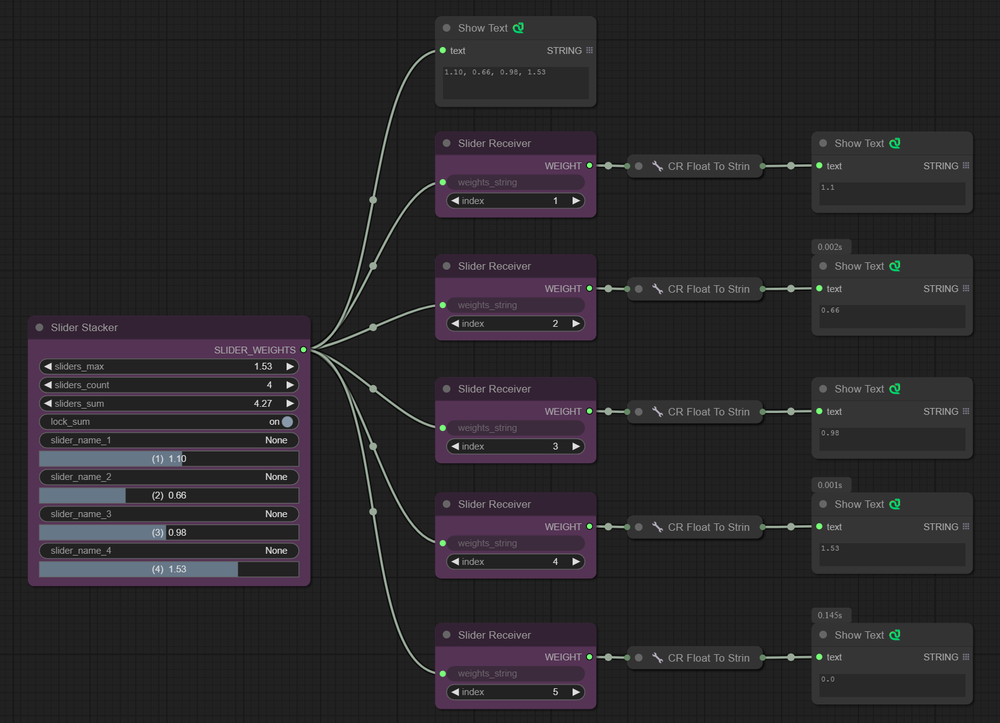

# Dynamic Sliders Stack for ComfyUI

A custom node pack for ComfyUI providing a stack of named sliders with dynamic behavior.

---

## 🚀 Features

- **Slider Stacker**: A node with a configurable number of named sliders (up to 50).
- **Slider Receiver**: Extracts the weight value of a specific slider from the stack output based on its index.
- **Dynamic Max Strength**: Adjusting the `slider_max_strength` scales all individual sliders proportionally.

  

- **Dynamic Individual Sliders**: Adjusting an individual `slider_wt` updates the `slider_max_strength` to reflect the new highest value among all sliders.
- **String Output**: Outputs a comma-separated string of the current weights for all active sliders.
- **Dynamic UI**: Automatically shows/hides slider input rows based on the `slider_count` setting.
- **Context Menu**: Right-click options for batch slider operations (Average, Reset, Set All to Max/Min).

  

---

## 📌 Nodes Overview

### Slider Stacker

- **Inputs**:
  - `slider_max_strength` (FLOAT): The master maximum value. Adjusting this scales all sliders below it.
  - `slider_count` (INT): Controls how many slider rows are visible and processed (1-50).
  - `slider_name_{i}` (STRING): A text field to name or describe the slider (optional).
  - `({i})` (FLOAT Widget): The individual weight for this slider (0.0-2.0). Adjusting this updates the `slider_max_strength` if this slider becomes the new maximum.

- **Output**:
  - `SLIDER_WEIGHTS` (STRING): A comma-separated string of the weight values for sliders 1 through `slider_count`, formatted to two decimal places (e.g., "1.00, 0.50, 0.75").

- **Right-Click Options**:
  - `Average Slider Values`: Sets all visible sliders to their average value.
  - `Reset Slider Values`: Resets all visible sliders to the default value (1.0).
  - `Set All to Max Value`: Finds the highest value among visible sliders and sets all visible sliders to that value.
  - `Set All to Min Value`: Finds the lowest value among visible sliders and sets all visible sliders to that value.

---

### Slider Receiver

- **Inputs**:
  - `weights_string` (STRING): Connect the `SLIDER_WEIGHTS` output from the `Slider Stacker` here.
  - `index` (INT): The 1-based index of the slider whose weight you want to extract (1-50).

- **Output**:
  - `WEIGHT` (FLOAT): The floating-point value of the slider at the specified index (returns 0.0 if the index is out of bounds or input is invalid).

---

## 🛠️ Installation

1. Ensure the folder containing these files is named `Dynamic_sliders_stack`.
2. Place the `Dynamic_sliders_stack` folder inside your ComfyUI `custom_nodes` directory.
3. Restart ComfyUI.

---

## 📖 Usage Example

1. Add a `Slider Stacker` node (found under the `Dynamic Sliders Stack` category).
2. Set the `slider_count`.
3. Adjust sliders or use right-click options.
4. Add a `Slider Receiver` node.
5. Connect `SLIDER_WEIGHTS` to `weights_string`.
6. Set the `index` on the Receiver.
7. Connect the `WEIGHT` output.

---

## 💡 Use Case Scenarios

This node setup provides a centralized control panel for managing multiple numerical weights within your workflow. Here are a few examples:

- **Multiple LoRA Weights**: Assign each slider to a different LoRA. Use the `Slider Stacker` to adjust the overall impact (`slider_max_strength`) or fine-tune individual LoRA weights. Use `Slider Receiver` to retrieve specific weights.
- **Prompt Segment Weighting**: Control the emphasis of different parts of a prompt.
- **Embedding/Textual Inversion Strength**: Manage multiple embeddings by connecting `Slider Receiver` outputs to nodes that adjust their strength.
- **Style/Character Consistency**: Group controls for multiple elements (LoRAs, weights) onto one `Slider Stacker` for centralized adjustments.
- **Controlling Custom Node Parameters**: Control FLOAT inputs for strength, weight, etc., in custom nodes with `Slider Receiver` outputs.
- **Centralized Control Panel**: Use one or more `Slider Stacker` nodes to create a 'dashboard' for managing weights.

---

## 📜 License

Check the LICENSE file. Remember to update the placeholder copyright line `Copyright (c) 2024 Your Name or Project Name Here` with the correct year and your name/project name.

---

This version improves readability and organizes the sections more effectively. Let me know if you’d like further adjustments!
